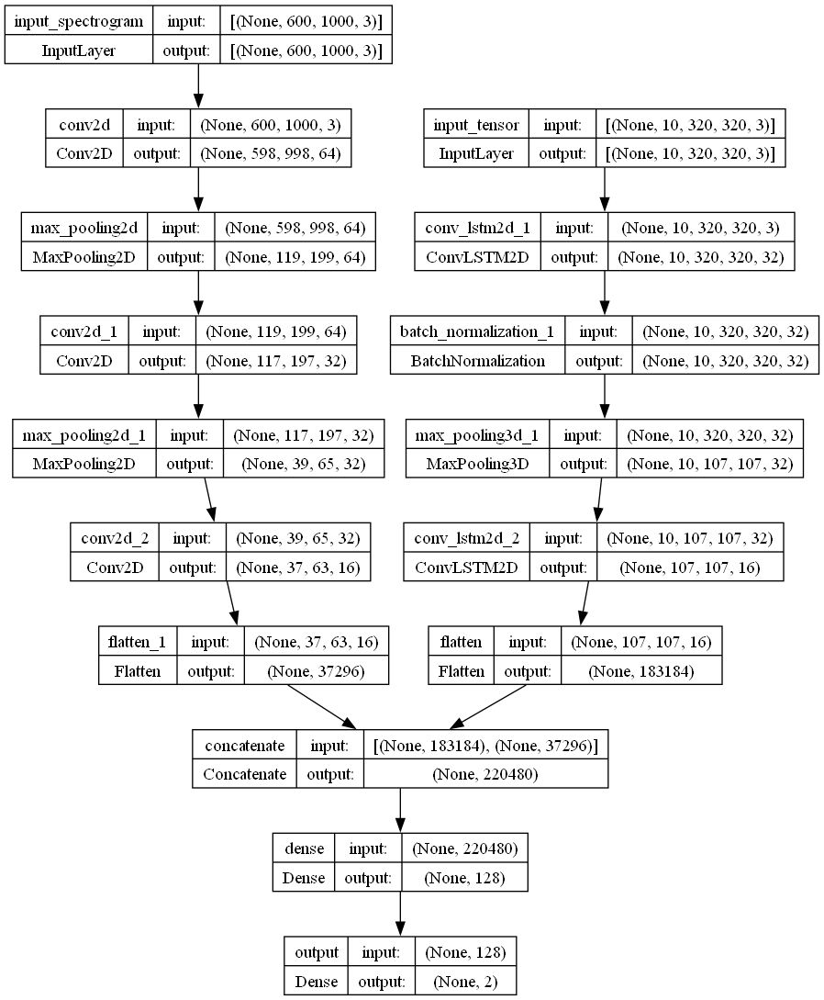

# Ad-Detection-BlockTv

This project focuses on developing a robust model for detecting commercials within video streams by leveraging both visual and audio data. We aim to employ Convolutional LSTM networks for processing visual information and simple convolutional neural networks for analyzing audio spectrograms. By combining these feature sets, our objective is to create a hybrid model capable of accurately classifying small sequences of videos as either commercial or content segments.

## Table of Contents
- [Dataset Generation](#dataset-generation)
  - [Overview](#overview)
  - [Usage](#usage)
- [Model Training](#model-training)
  - [Overview](#overview-1)
  - [Usage](#usage-1)

## Dataset Generation

### Overview

To facilitate the training of our commercial detection model, we first create a labeled dataset by annotating the start and end times of commercials within video streams. Subsequently, we segment the video data into separate clips, distinguishing between commercial and content segments. Each segment is then further divided into smaller segments of a chosen length, typically 1 or 2 seconds.

### Usage

To generate the dataset, you'll first need to create a CSV file from the annotations provided. The annotations should be in the following format: 

01-S=00:00:05 E=00:02:50


Once you have the annotations in the correct format, you can use the `ffmpeg-split.py` script to segment the video into smaller video chunks of commercials and content.
```bash
# For more details see README file in generate_dataset
$ python ffmpeg-split.py -f big_video_file.mp4 -m video_segments.csv
```
After segmentation, utilize the `data_creation.py` script to create the input dataset for the model.

```bash
# Example command to categorize videos into folders
$ python data_creation.py --videos_folder segmented_videos --output_folder dataset_folder --chunk_duration 1 --videos_per_batch 10
```
In the above command:

- `--videos_folder` is the folder containing the segmented videos generated by `ffmpeg-split.py`.
- `--output_folder` is the output folder where the dataset will be created.
- `--chunk_duration` specifies the duration of each chunk in seconds.
- `--videos_per_batch` specifies the number of videos per batch.

Make sure to replace `segmented_videos` and `dataset_folder` with the appropriate paths in your system.

## Dataset Generation

### Overview

Our deep learning model for commercial detection combines both visual and audio modalities to effectively classify small segments of video streams as either commercial or content segments. The model architecture comprises two main components:

1. **Visual Processing Module:** Utilizing Convolutional LSTM (Long Short-Term Memory) networks, this module processes the visual data extracted from video segments. By capturing both spatial and temporal features, the Convolutional LSTM effectively analyzes the dynamics and context within the video frames, enabling the model to discern patterns indicative of commercials.
2. **Audio Processing Module**: Employing simple convolutional neural networks, the audio processing module analyzes the spectrograms generated from the audio segments of the video. These networks extract relevant features from the frequency domain, providing complementary information to the visual data for accurate classification.
3. **Integration and Fusion:** The features extracted from both modalities are integrated and fused within the model architecture. This integration enables the model to learn from the combined representation of visual and audio cues, enhancing its ability to discriminate between commercial and content segments effectively.

<div style="text-align:center">
  
</div>

### Usage

To train the model, follow these steps:

1. Ensure you have the dataset prepared.
2. Use the `train.py` script with the following arguments:

```bash
# Example command to train the model
$ python train.py --dataset_path path/to/dataset --batch_size 32 --epochs 100 --save_model_path trained_model.h5
```

- `--dataset_path`: The path to the dataset folder containing class folders for data loading.
- `--batch_size`: Specifies the batch size for training. Default is 1.
- `--epochs`: Specifies the number of training epochs. Default is 1.
- `--save_model_path`: The path to save the trained model. Default is `trained_model.h5`.
